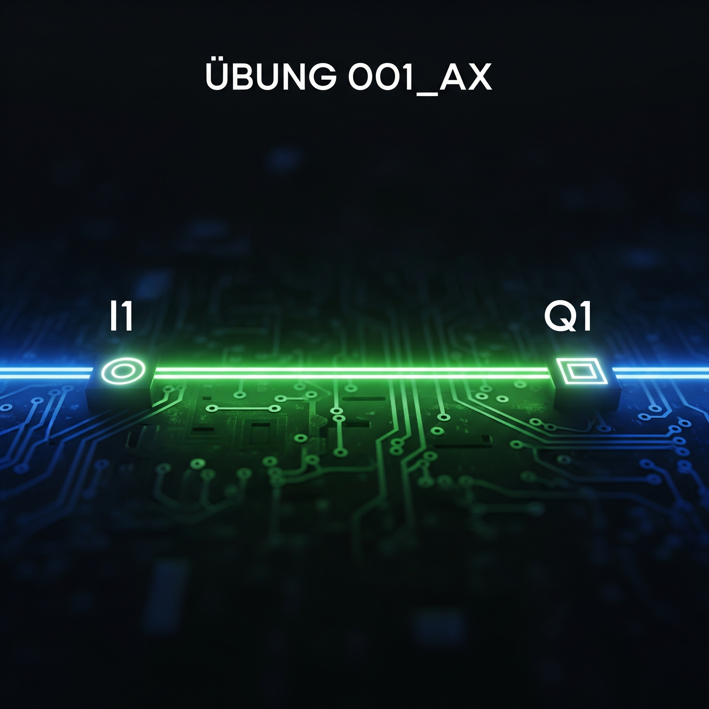
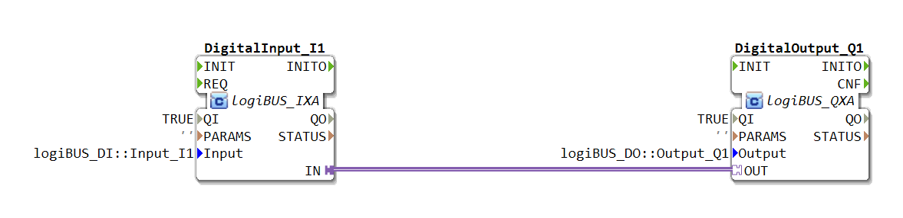

# Uebung_001_AX: DigitalInput_I1 auf DigitalOutput_Q1, mit Plug and Socket

[Uebung_001_AX](https://docs.ms-muc-docs.de/projects/visual-programming-languages-docs/de/latest/training1/Ventilsteuerung/4diacIDE-workspace/test/FBs/Uebungen/Uebung_001_AX.html)

[](https://notebooklm.google.com/notebook/041f4df4-b729-484d-b786-b6dcdf151961)

Dieser Artikel beschreibt die grundlegende logiBUS®-Übung `Uebung_001_AX`, bei der ein digitaler Eingang direkt mit einem digitalen Ausgang verbunden wird, unter Verwendung des Adapters AX.


## Podcast
<iframe src="https://creators.spotify.com/pod/profile/logibus/embed/episodes/logiBUS-verstehen-Direkte-Signalweiterleitung--Das-Hallo-Welt-der-Automatisierung-e36vlfg/a-ac3vagq" height="102px" width="400px" frameborder="0" scrolling="no"></iframe>

----







## Ziel der Übung

Das Hauptziel dieser Übung ist es, das grundlegende Prinzip der direkten Signalweiterleitung von einem physischen digitalen Eingang zu einem physischen digitalen Ausgang zu demonstrieren. Dabei wird das "Plug and Socket"-Konzept der IEC 61499 mittels einer Adapter-Schnittstelle verwendet. Die Logik ist denkbar einfach: Der Zustand des Ausgangs soll immer dem Zustand des Eingangs entsprechen.

-----

## Beschreibung und Komponenten

[cite\_start]Die Übung besteht aus einer Subapplikation (`Uebung_001_AX.SUB`), die zwei Funktionsbausteine über eine Adapterverbindung miteinander verknüpft[cite: 1]. [cite\_start]Als Schnittstelle für diese Verbindung dient der Adapter-Typ `AX.adp`[cite: 2].

### Funktionsbausteine (FBs)

In der Subapplikation werden zwei zentrale Funktionsbausteine instanziiert:

  * **`DigitalInput_I1`**: Eine Instanz des Typs `logiBUS_IXA`. Dieser Baustein repräsentiert einen physischen digitalen Eingang. [cite\_start]Über den Parameter `Input` wird er fest mit dem Hardware-Eingang `logiBUS_DI::Input_I1` verdrahtet[cite: 1].
  * **`DigitalOutput_Q1`**: Eine Instanz des Typs `logiBUS_QXA`. Dieser Baustein repräsentiert einen physischen digitalen Ausgang. [cite\_start]Sein Parameter `Output` verweist auf den Hardware-Ausgang `logiBUS_DO::Output_Q1`[cite: 1].

### Adapter-Schnittstelle: `AX.adp`

Die Verbindung zwischen den beiden Bausteinen wird durch den Adapter-Typ `AX` realisiert. [cite\_start]Es handelt sich um eine unidirektionale (einseitig gerichtete) Schnittstelle, die definiert ist, um genau ein Ereignis und einen dazugehörigen booleschen Datenwert zu übertragen[cite: 2].

  * [cite\_start]**Event `E1`**: Ein Ereignis, das eine Zustandsänderung signalisiert[cite: 2].
  * [cite\_start]**Variable `D1` (BOOL)**: Der boolesche Wert (wahr/falsch), der mit dem Ereignis `E1` gesendet wird[cite: 2].

-----

## Funktionsweise

Die Logik wird ausschließlich durch die Verbindung der beiden Bausteine realisiert. In der Subapplikation `Uebung_001_AX.SUB` wird der "Plug" des Eingangsbausteins mit der "Socket" des Ausgangsbausteins verbunden:

```xml
<AdapterConnections>
    <Connection Source="DigitalInput_I1.IN" Destination="DigitalOutput_Q1.OUT"/>
</AdapterConnections>
```

[cite\_start][cite: 1]

Dieser einzelnen Zeile Code implementiert die gesamte Funktionalität:

1.  Der Baustein `DigitalInput_I1` liest kontinuierlich den Zustand des physischen Eingangs `Input_I1`.
2.  Sobald sich der Zustand des Eingangs ändert, sendet der Baustein über seinen `IN`-Adapter-Anschluss (den "Plug") das Ereignis `E1` zusammen mit dem aktuellen booleschen Zustand (`D1`).
3.  Der Baustein `DigitalOutput_Q1` empfängt dieses Ereignis und den Datenwert an seinem `OUT`-Anschluss (der "Socket").
4.  Unmittelbar nach dem Empfang setzt der `DigitalOutput_Q1`-Baustein den physischen Ausgang `Output_Q1` auf den empfangenen Wert von `D1`.

Im Ergebnis spiegelt der **digitale Ausgang Q1** exakt und in Echtzeit den Zustand des **digitalen Eingangs I1**.

-----

## Anwendungsbeispiel

Diese Konfiguration ist die einfachste Form einer Steuerungsanwendung und dient oft als "Hallo Welt"-Beispiel für die Hardware-Anbindung in logiBUS®. Ein praktischer Anwendungsfall wäre ein einfacher **Funktionstest** für die Verdrahtung:

  * An `Input_I1` wird ein Schalter angeschlossen.
  * An `Output_Q1` wird eine Lampe angeschlossen.

Wird der Schalter betätigt, muss die Lampe sofort aufleuchten. Dies bestätigt, dass sowohl der Eingangs- als auch der Ausgangskanal korrekt konfiguriert und verdrahtet sind.
