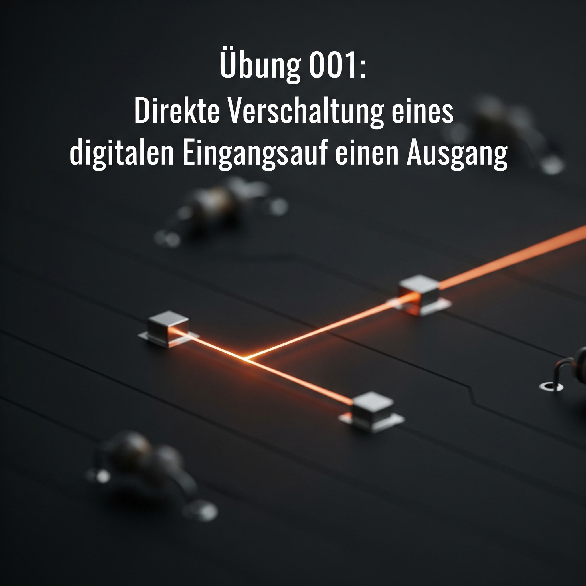
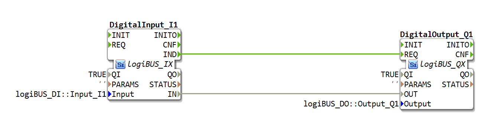

# Uebung_001: DigitalInput_I1 auf DigitalOutput_Q1

[Uebung_001](https://docs.ms-muc-docs.de/projects/visual-programming-languages-docs/de/latest/training1/Ventilsteuerung/4diacIDE-workspace/test/FBs/Uebungen/Uebung_001.html)

Dieser Artikel beschreibt die grundlegende logiBUS®-Übung `Uebung_001`, bei der ein digitaler Eingang direkt mit einem digitalen Ausgang verbunden wird.

## Podcast
<iframe src="https://creators.spotify.com/pod/profile/logibus/embed/episodes/LogiBUS--IEC-61499-Daten--und-Ereignisflsse-einfach-erklrt--Vom-Schalter-zur-intelligenten-Steuerung-e36vldb/a-ac3vadb" height="102px" width="400px" frameborder="0" scrolling="no"></iframe>

----

## Übersicht

**Übung 001** ist ein grundlegendes Anwendungsbeispiel im logiBUS®-System. Das Ziel dieser Übung ist es, den Zustand eines digitalen Eingangssignals direkt an einen digitalen Ausgang weiterzuleiten. Wenn der Eingang `TRUE` (wahr) ist, soll auch der Ausgang `TRUE` sein.

**Kernfunktionalität:** `DigitalInput_I1` ➡️ `DigitalOutput_Q1`

## Verwendete Funktionsbausteine (FBs)

In dieser Übung werden zwei zentrale Funktionsbausteine aus der logiBUS®-Bibliothek verwendet:

### 1. DigitalInput_I1
Dieser Baustein repräsentiert einen physikalischen digitalen Eingang.
* [cite_start]**Name**: `DigitalInput_I1` [cite: 1]
* [cite_start]**Typ**: `logiBUS_IX` [cite: 1]
* [cite_start]**Konfigurierter Eingang**: `logiBUS_DI::Input_I1` [cite: 1]

### 2. DigitalOutput_Q1
Dieser Baustein repräsentiert einen physikalischen digitalen Ausgang.
* [cite_start]**Name**: `DigitalOutput_Q1` [cite: 1]
* [cite_start]**Typ**: `logiBUS_QX` [cite: 1]
* [cite_start]**Konfigurierter Ausgang**: `logiBUS_DO::Output_Q1` [cite: 1]

## Programmablauf und Verbindungen

Die Logik der Anwendung wird durch die Verbindung der beiden Funktionsbausteine realisiert.

### Datenverbindung (Data Connection)

Die wesentliche Logik wird über die Datenverbindung hergestellt:
* [cite_start]Der Ausgangs-Datenpin `IN` des `DigitalInput_I1` Bausteins wird mit dem Eingangs-Datenpin `OUT` des `DigitalOutput_Q1` Bausteins verbunden. [cite: 1]

Dadurch wird der boolesche Wert (TRUE/FALSE) des Eingangs direkt an den Ausgang übergeben.

### Ereignisverbindung (Event Connection)

Damit der Ausgangsbaustein weiß, *wann* er den neuen Datenwert verarbeiten soll, wird eine Ereignisverbindung genutzt:
* [cite_start]Der Ereignis-Ausgangspin `IND` (Indication) des `DigitalInput_I1` wird mit dem Ereignis-Eingangspin `REQ` (Request) des `DigitalOutput_Q1` verbunden. [cite: 1]

Immer wenn sich der Zustand des Eingangs ändert, sendet der `IND`-Pin ein Ereignis, welches den `DigitalOutput_Q1`-Baustein auffordert, den anliegenden Datenwert zu lesen und zu setzen.

## Zusammenfassung

Diese einfache Übung demonstriert das grundlegende Prinzip der IEC 61499, bei dem Daten- und Ereignisflüsse getrennt voneinander definiert werden. Der Wert von **`Input_I1`** wird gelesen und ohne weitere logische Verarbeitung direkt an **`Output_Q1`** geschrieben, sobald eine Zustandsänderung am Eingang stattfindet.

