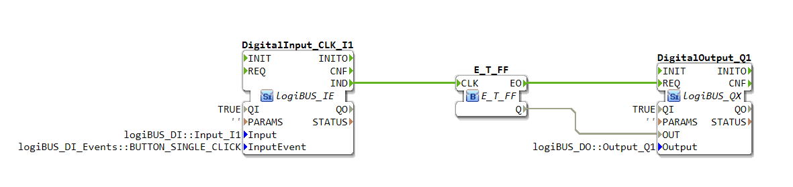

# Uebung_004a: Toggle Flip-Flop mit IE mit BUTTON_SINGLE_CLICK

[Uebung_004a](https://docs.ms-muc-docs.de/projects/visual-programming-languages-docs/de/latest/training1/Ventilsteuerung/4diacIDE-workspace/test/FBs/Uebungen/Uebung_004a.html)

Die Übung **Uebung_004a** ist eine Anwendungsaufgabe für das logiBUS®-System, die ein einfaches Toggle Flip-Flop realisiert. Dabei wird der Zustand eines digitalen Ausgangs durch einen einzelnen Tastendruck an einem digitalen Eingang umgeschaltet.

## Podcast
<iframe src="https://creators.spotify.com/pod/profile/logibus/embed/episodes/Schalterlogik-verstehen-So-funktioniert-ein-Toggle-Flip-Flop-mit-logiBUS--einfache-Steuerung-in-der-Landtechnik-e36vjo1" height="102px" width="400px" frameborder="0" scrolling="no"></iframe>

----

## Übersicht

Das logiBUS®-System vereinfacht die Programmierung von ISOBUS-kompatiblen Steuerungen für landtechnische Anwendungen durch einen grafischen, bausteinbasierten Ansatz. Diese Übung demonstriert grundlegende Prinzipien der Ereignissteuerung und Logikverarbeitung innerhalb der logiBUS®-Entwicklungsumgebung, die auf Eclipse 4diac™ basiert.

---

## Funktionsweise

Die Applikation wartet auf ein bestimmtes Ereignis an einem digitalen Eingang, das hier als `BUTTON_SINGLE_CLICK` definiert ist. Sobald dieses Ereignis eintritt, wird ein `E_T_FF` (Toggle Flip-Flop) Funktionsbaustein angesteuert. Dieser Baustein ändert bei jeder Aktivierung seinen Ausgangszustand `Q` (von `TRUE` auf `FALSE` oder umgekehrt). Der Zustand des Flip-Flops wird dann an einen digitalen Ausgang weitergeleitet, wodurch beispielsweise eine Lampe oder ein anderer Aktor ein- oder ausgeschaltet wird.

---

## Komponenten

Die Übung besteht aus drei zentralen Funktionsbausteinen (FBs):

* **DigitalInput_CLK_I1 (`logiBUS_IE`)**: Dieser Baustein repräsentiert einen digitalen Eingangskanal.
    * **Input**: `logiBUS_DI::Input_I1` – Verwendet den physischen Eingang I1.
    * **InputEvent**: `logiBUS_DI_Events::BUTTON_SINGLE_CLICK` – Löst das Ausgangsereignis `IND` nur bei einem einzelnen, definierten Klick aus.

* **E_T_FF (`E_T_FF`)**: Ein Ereignis-gesteuertes Toggle Flip-Flop. Dieser Standard-Logikbaustein wechselt seinen Ausgangszustand `Q` jedes Mal, wenn er am `CLK`-Eingang ein Ereignis empfängt.

* **DigitalOutput_Q1 (`logiBUS_QX`)**: Repräsentiert einen digitalen Ausgangskanal.
    * **Output**: `logiBUS_DO::Output_Q1` – Steuert den physischen Ausgang Q1.
    * **QI**: `TRUE` – Der Ausgang ist aktiviert.

---

## Verbindungen

Die Funktionsweise wird durch die logische Verknüpfung der Bausteine realisiert:

### Ereignisverbindungen:
* Eine Verbindung vom `IND`-Ausgang des `DigitalInput_CLK_I1` zum `CLK`-Eingang des `E_T_FF`. Dadurch wird das Flip-Flop getriggert, sobald ein einzelner Klick am Eingang I1 erkannt wird.
* Eine Verbindung vom `EO`-Ausgang des `E_T_FF` zum `REQ`-Eingang des `DigitalOutput_Q1`. Nachdem das Flip-Flop seinen Zustand geändert hat, wird der Ausgangsbaustein zur Aktualisierung aufgefordert.

### Datenverbindungen:
* Eine Verbindung vom `Q`-Ausgang des `E_T_FF` zum `OUT`-Eingang des `DigitalOutput_Q1`. Der logische Zustand (TRUE/FALSE) des Flip-Flops wird so direkt an den Ausgang Q1 übergeben.
