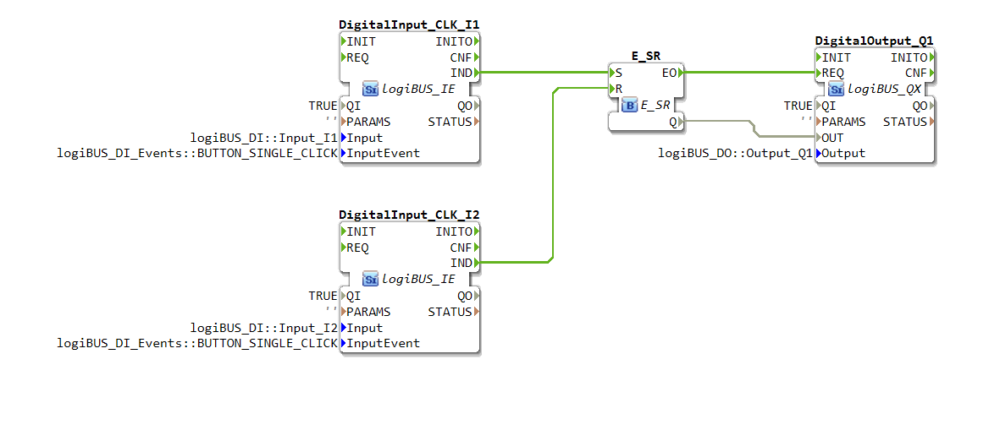

# Uebung_006: SR-Flip-Flop mit 2x IE

[Uebung_006](https://docs.ms-muc-docs.de/projects/visual-programming-languages-docs/de/latest/training1/Ventilsteuerung/4diacIDE-workspace/test/FBs/Uebungen/Uebung_006.html)

In dieser Übung wird ein **SR-Flip-Flop** (auch als SR-Latch bezeichnet) unter Verwendung von zwei ereignisgesteuerten Eingängen (IE) auf dem logiBUS®-System realisiert. Ziel ist es, das grundlegende Verhalten einer bistabilen Kippstufe zu verstehen, bei der ein Ausgang durch separate Signale gesetzt und zurückgesetzt werden kann.

## Podcast
<iframe src="https://creators.spotify.com/pod/profile/logibus/embed/episodes/Digitale-Gedchtnisse-Das-SR-Flip-Flop-im-logiBUS-System-erklrt-e36vksj/a-ac3v9ne" height="102px" width="400px" frameborder="0" scrolling="no"></iframe>
---

## **Übersicht und Ziel**

Ein SR-Flip-Flop ist ein grundlegender digitaler Speicherbaustein. Er hat zwei Eingänge, **S (Set)** und **R (Reset)**, sowie einen Ausgang **Q**.

* Ein Signal am **S-Eingang** "setzt" den Ausgang Q auf `TRUE` (logisch 1).
* Ein Signal am **R-Eingang** "setzt zurück" (resettet) den Ausgang Q auf `FALSE` (logisch 0).
* Der Zustand von Q bleibt so lange gespeichert, bis ein neues Signal an einem der Eingänge anliegt.

[cite_start]In dieser speziellen Übung werden die Signale S und R durch das einmalige Drücken von zwei Tastern (`BUTTON_SINGLE_CLICK`) erzeugt. [cite: 1]

---

## **Verwendete Funktionsbausteine (FBs)**

In der Übung kommen die folgenden logiBUS®-Funktionsbausteine zum Einsatz:

| Name im Programm | Typ | Funktion |
| :--- | :--- | :--- |
| `DigitalInput_CLK_I1` | `logiBUS_IE` | Stellt den **Set (S)**-Eingang dar. [cite_start]Er ist mit dem physikalischen Eingang `Input_I1` verbunden und löst ein Ereignis bei einem einfachen Tastendruck aus. [cite: 1] |
| `DigitalInput_CLK_I2` | `logiBUS_IE` | Stellt den **Reset (R)**-Eingang dar. [cite_start]Er ist mit dem physikalischen Eingang `Input_I2` verbunden und löst ebenfalls bei einem einfachen Tastendruck aus. [cite: 1] |
| `E_SR` | `E_SR` | [cite_start]Dies ist der eigentliche **SR-Flip-Flop**-Baustein, der die Setz- und Rücksetzlogik verarbeitet. [cite: 1] |
| `DigitalOutput_Q1` | `logiBUS_QX` | [cite_start]Dieser Baustein steuert den physikalischen Ausgang `Output_Q1` an und visualisiert den Zustand des **Q-Ausgangs** des Flip-Flops. [cite: 1] |

---

## **Logik und Verschaltung**

Die Funktionsweise wird durch die Verbindungen (Connections) zwischen den Bausteinen realisiert.

### **Ereignisverbindungen (Event Connections)**

Die Ereignisverbindungen steuern, wann ein Funktionsbaustein ausgeführt wird.

1.  [cite_start]**Setzen:** Wenn der Taster an `Input_I1` gedrückt wird (`DigitalInput_CLK_I1.IND`), wird ein Ereignis an den **S-Eingang** des `E_SR`-Bausteins gesendet. [cite: 1]
2.  [cite_start]**Rücksetzen:** Ein Tastendruck an `Input_I2` (`DigitalInput_CLK_I2.IND`) sendet ein Ereignis an den **R-Eingang** des `E_SR`-Bausteins. [cite: 1]
3.  [cite_start]**Ausgang ansteuern:** Nachdem der `E_SR`-Baustein seinen neuen Zustand berechnet hat (`E_SR.EO`), sendet er ein Ereignis an den Ausgangsbaustein `DigitalOutput_Q1.REQ`, um diesen zu aktualisieren. [cite: 1]

### **Datenverbindungen (Data Connections)**

Die Datenverbindungen übertragen die logischen Zustände (`TRUE` oder `FALSE`).

* [cite_start]Der **Q-Ausgang** des `E_SR`-Flip-Flops ist direkt mit dem **OUT-Eingang** des `DigitalOutput_Q1`-Bausteins verbunden. [cite: 1] Das bedeutet: Ist Q `TRUE`, wird der Ausgang Q1 aktiviert (z.B. eine LED leuchtet). Ist Q `FALSE`, wird der Ausgang deaktiviert.

---

## **Funktionsweise im Detail**

1.  **Startzustand:** Zu Beginn ist der Ausgang Q des `E_SR`-Bausteins `FALSE`, und der Ausgang Q1 ist aus.
2.  **Setzen:** Der Benutzer drückt den Taster, der mit `Input_I1` verbunden ist.
    * Der `DigitalInput_CLK_I1`-Baustein löst das Ereignis `IND` aus.
    * Dieses Ereignis triggert den `S`-Eingang des `E_SR`-Flip-Flops.
    * Der `E_SR`-Baustein setzt seinen Ausgang `Q` auf `TRUE`.
    * Dieser `TRUE`-Wert wird über die Datenverbindung an den `DigitalOutput_Q1` übertragen, der daraufhin den physikalischen Ausgang `Output_Q1` einschaltet.
3.  **Zustand speichern:** Der Ausgang Q1 bleibt eingeschaltet, auch nachdem der Taster an I1 losgelassen wurde. Der Zustand ist nun gespeichert.
4.  **Rücksetzen:** Der Benutzer drückt den Taster, der mit `Input_I2` verbunden ist.
    * Der `DigitalInput_CLK_I2`-Baustein löst das Ereignis `IND` aus.
    * Dieses Ereignis triggert den `R`-Eingang des `E_SR`-Flip-Flops.
    * Der `E_SR`-Baustein setzt seinen Ausgang `Q` zurück auf `FALSE`.
    * Dieser `FALSE`-Wert wird an `DigitalOutput_Q1` weitergegeben, der den Ausgang `Output_Q1` wieder ausschaltet.
5.  **Zustand bleibt gespeichert:** Der Ausgang Q1 bleibt nun aus, bis der Taster an I1 erneut gedrückt wird.